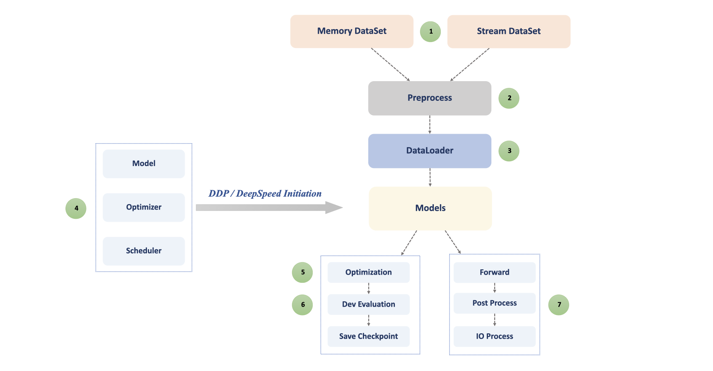

## Optimization Techniques In General Training / Inference

> This is the training / inference workflow of general supervised task.

#### Optimization Techniques
1. **Dataset Optimzation**
   1. Efficient Indexing
   2. Multi-Thread IO Reading
2. **C / C++ Extension**
3. **Multi Process Prefetch**
4. **Model & Optimizer Optimization**
   1. CUDA Kernel Optimzation
   2. Efficient Beam Search
   3. Efficient Optimizer
   4. Gradient Checkpointing
5. **DDP Training / DeepSpeed ZERO Optimization**
6. **DDP Evaluation**
7. **Asynchronous Post & IO Process**

